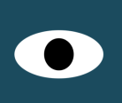

# EyeMovement 

    Name: Eye Movement Exercise  

    Description: This web page is an example of how to use JavaScript to set web page styles.
It's a good way to bind a code to user actions.  
Mouse events are a popular way to bind the DOM elements to events.

onmousemove usage in the JavaScript code.
We will use "mousemove" in our the 
code to triggered a response when the mouse moves over an element.

In our case, when the mouse moves near or around the eye the 
"eyeball" will move along with the mouse.

To be more specific, I was tasked to add the "eye" element that follows 
the mouse position on the screen using the mouse events.

    Installation: //opensourse //

    Usage: these files can be used to teach DOM, js manipuation 

    Support: TBA

    Roadmap: TBA 
    
    License information: //  MIT License

Copyright (c) [2022-2023] [K. Artis-Mickens]

Permission is hereby granted, free of charge, to any person obtaining a copy
of this software and associated documentation files (the "Software"), to deal
in the Software without restriction, including without limitation the rights
to use, copy, modify, merge, publish, distribute, sublicense, and/or sell
copies of the Software, and to permit persons to whom the Software is
furnished to do so, subject to the following conditions:

The above copyright notice and this permission notice shall be included in all
copies or substantial portions of the Software.

THE SOFTWARE IS PROVIDED "AS IS", WITHOUT WARRANTY OF ANY KIND, EXPRESS OR
IMPLIED, INCLUDING BUT NOT LIMITED TO THE WARRANTIES OF MERCHANTABILITY,
FITNESS FOR A PARTICULAR PURPOSE AND NONINFRINGEMENT. IN NO EVENT SHALL THE
AUTHORS OR COPYRIGHT HOLDERS BE LIABLE FOR ANY CLAIM, DAMAGES OR OTHER
LIABILITY, WHETHER IN AN ACTION OF CONTRACT, TORT OR OTHERWISE, ARISING FROM,
OUT OF OR IN CONNECTION WITH THE SOFTWARE OR THE USE OR OTHER DEALINGS IN THE
SOFTWARE.
    
    
